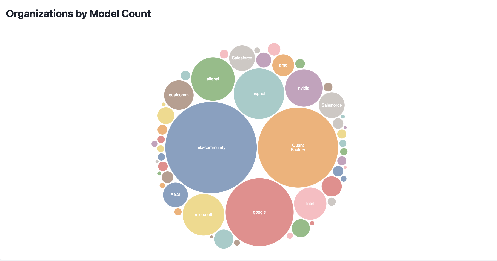
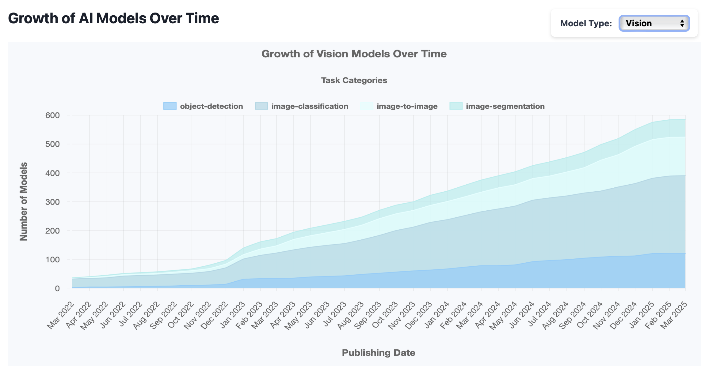
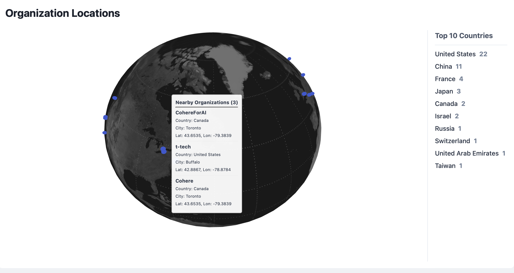

<div align="center">

  # Visualizing AI Models Evolution Over Time

  **Exploring the dynamic landscape of AI model development through interactive visualization.**

  [](https://www.python.org/)
  [](https://flask.palletsprojects.com/)
  [](https://pandas.pydata.org/)
  [](https://www.crummy.com/software/BeautifulSoup/)
  [](https://groq.com/)
  [](https://github.com/geopy/geopy)
  [](https://developer.mozilla.org/en-US/docs/Web/Guide/HTML/HTML5)
  [](https://developer.mozilla.org/en-US/docs/Web/API/CSS)
  [](https://developer.mozilla.org/en-US/docs/Web/JavaScript)
  [](https://d3js.org/)
  [](https://threejs.org/)
  [](https://www.chartjs.org/)
  [](https://swiperjs.com/)
  [](https://www.docker.com/)
  [](http://e-order.ru:5001)
  

</div>

## 🎯 Project Overview
This project provides a data visualization platform to explore the evolution of machine learning models over time. By analyzing key attributes of models (size, popularity, category) and the communities developing them (location, contributions), we offer insights into trends within the AI field.

**Target Audience**: AI researchers, data scientists, industry professionals, and enthusiasts seeking to understand AI progression, identify milestones, track trends, and compare models/communities.


## 🌐 Live Demo
Explore the interactive application hosted at:
**[http://e-order.ru:5001](http://e-order.ru:5001)**

## 🚀 Getting Started (Docker)

1.  **Clone the repository:**
    ```bash
    git clone https://github.com/Data-Wrangling-and-Visualisation/DWV_AI_Evolution
    ```
2.  **(Optional) Configure Environment:** If needed, create and populate a `.env` file. Here's an example:
    ```dotenv
    # .env
    HF_TOKEN=hf_YOUR_HUGGINGFACE_TOKEN
    GROQ_API_KEY=gsk_YOUR_GROQ_API_KEY
    GROQ_MODEL=deepseek-r1-distill-llama-70b # Or your preferred model
    ```
3.  **Build and run containers:**
    ```bash
    docker-compose up --build -d
    ```
4.  **Access the application:** Open your browser and navigate to `http://localhost:5001` (or the configured frontend port).

## 📊 Dataset

### Data Sources
| Source | Purpose | Tools Used |
|---|---|---|
| **HuggingFace** | Fetch core AI model metadata & organization info | Hugging Face API, `requests` |
| **Wikipedia** | Scrape additional company/organization details | `BeautifulSoup4` |
| **GitHub** | Scrape additional company/organization details | `BeautifulSoup4` |

### Data Content
- **Models**: Size, downloads, likes, task/model category, creators, publish date, Twitter mentions.
- **Communities**: Name, location, models developed.

*Note: The dataset was collected once for this project. Continuous updates are recommended for ongoing relevance.*

## 🏗️ Architecture & Pipeline
The application follows a standard data visualization pipeline:
1.  **Data Collection**: Fetch model data via Hugging Face API; scrape community details from Hugging Face, Wikipedia, GitHub.
2.  **Preprocessing**: Clean and transform data using Pandas; use Groq AI for structured data extraction from web pages; enrich organization data with coordinates using `geopy`.
3.  **EDA**: Analyze trends (model growth, popularity, geographic distribution) using notebooks (located in `src/visualization/`).
4.  **Storage & API**: Store processed data in JSON files; serve data via a Flask REST API.
5.  **Visualization**: Render interactive charts and the 3D globe using D3.js, Chart.js, and Three.js in the frontend.

## 🛠️ Technologies Used

### Backend & Data Handling
| Technology | Role |
|---|---|
|  | Backend logic, data collection scripts |
|  | REST API development to serve data |
|  | Data cleaning, preprocessing, transformation |
|  | HTML parsing for web scraping |
|  | AI for data extraction & inference |
|  | Geolocation data retrieval |

### Frontend & Visualization
| Technology | Role |
|---|---|
|  | Structure of the web application |
|  | Styling the user interface |
|  | Interactivity, API communication, UI logic |
|  | Interactive data visualizations (Bubble charts, Bar charts) |
|  | 3D Globe visualization for organization locations |
|  | Various charts (Pie, Bar, Bubble, Stacked Area) |
|  | Carousel component for navigation |

### Deployment
| Technology | Role |
|---|---|
|  | Containerization and orchestration |

## 📂 Repository Structure

The project is organized into the following main directories:

-   `src/`: Contains the core application code:
    -   `data_collection/`: Scripts for collecting data from Hugging Face, Wikipedia, and GitHub.
    -   `backend/`: The Flask application serving the collected data via a REST API.
    -   `frontend/`: The HTML, CSS, and JavaScript files for the user interface and interactive visualizations.
    -   `visualization/`: Contains Jupyter notebooks used for Exploratory Data Analysis (EDA).
-   `data/`: Stores the collected raw and/or processed data files (e.g., CSV, JSON).
-   `images/`: Contains screenshots used in the README and potentially other static image assets.

## 🖼️ Visualization Highlights

Examples of visualizations available in the application:

**Model Popularity & Size Evolution (Bubble Chart):**


**Model Growth Over Time (Stacked Area Chart):**


**Organization Locations (3D Globe):**



## Checkpoint 2

This checkpoint marks the implementation of several key components:

1.  **Organization Data Collection Pipeline**: Added a pipeline to collect data about the top organizations on Hugging Face, complementing the existing model metadata collection.
2.  **Backend Implementation**: Developed a backend using Flask to serve the collected model and organization data via a REST API.
3.  **Frontend Development**: Built the frontend interface using HTML, CSS, and JavaScript.
    - Implemented a carousel (`Swiper.js`) for navigation.
    - Created interactive visualizations using Chart.js and D3.js, including:
        - Model Category Distribution (Pie Chart)
        - Top Task Categories (Bar Chart)
        - Model Popularity & Size Evolution (Bubble Chart - Chart.js)
        - Model Growth Over Time (Stacked Area Chart)
        - Top Creators (Bar Chart)
        - Major Tech Company Contributions (Bar Chart)
        - Major Tech Company Model Categories (Pie Chart)
        - Major Tech Company Top Models (Bar Chart)
        - Organization Locations (3D Globe - Three.js)
        - Organizations by Model Count (Bubble Chart - D3.js)
        - Top Organizations by Followers (Bar Chart - D3.js)
        - Top Organizations by Contributors (Bar Chart - D3.js)
4.  **Containerization**: Packaged the application components (backend, frontend, database) into Docker containers and orchestrated them using Docker Compose for easier setup and deployment.

